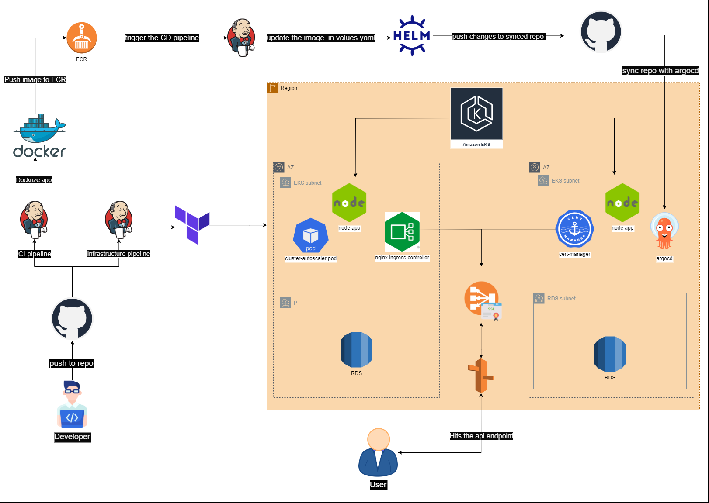
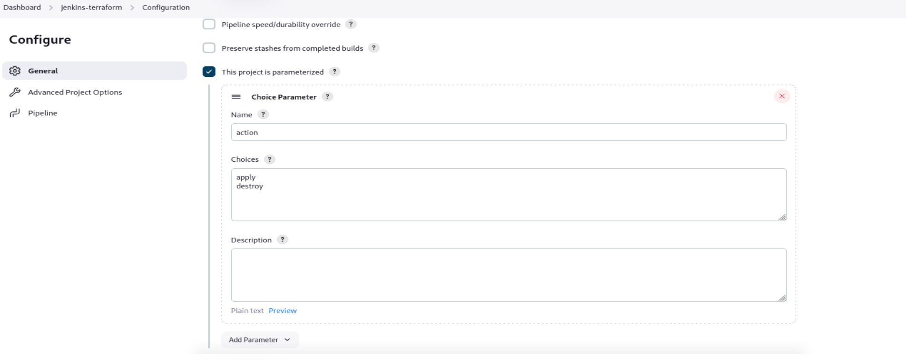
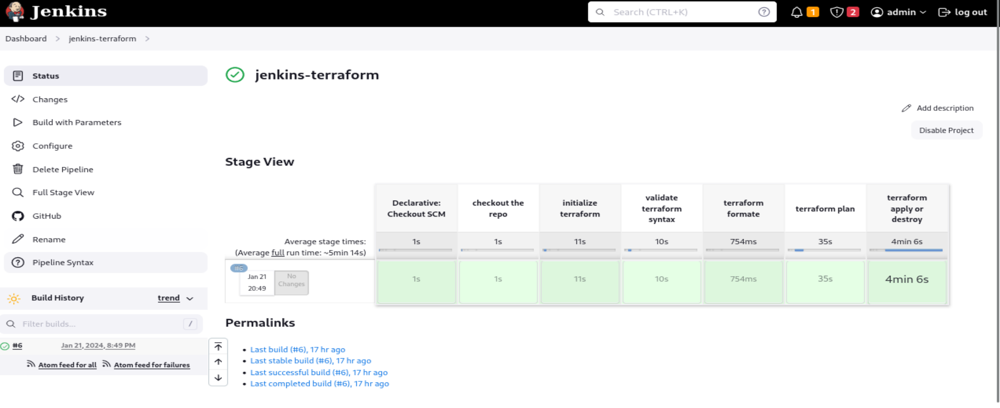
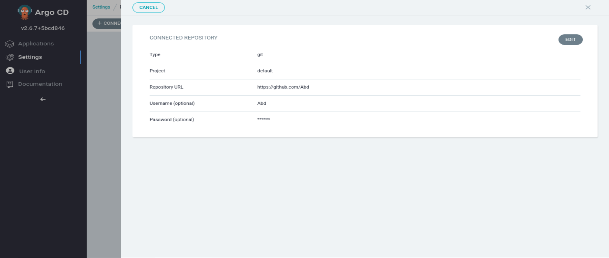
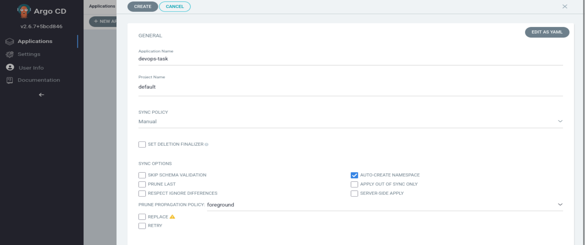
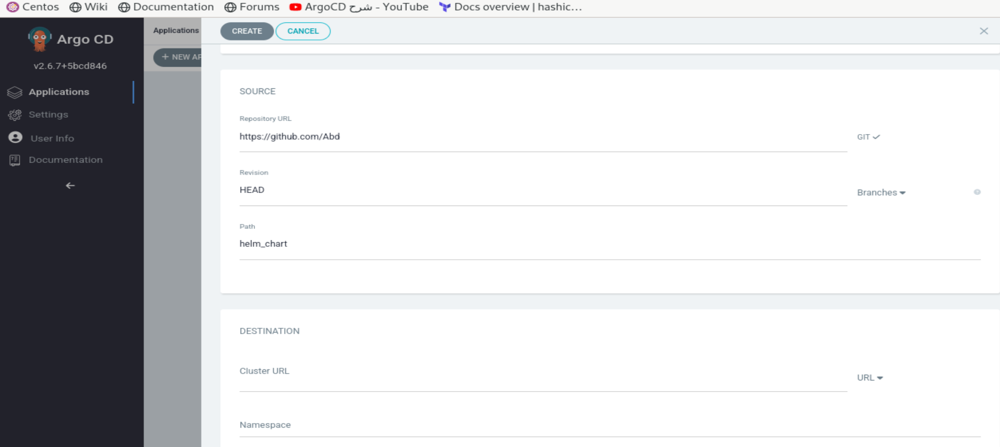
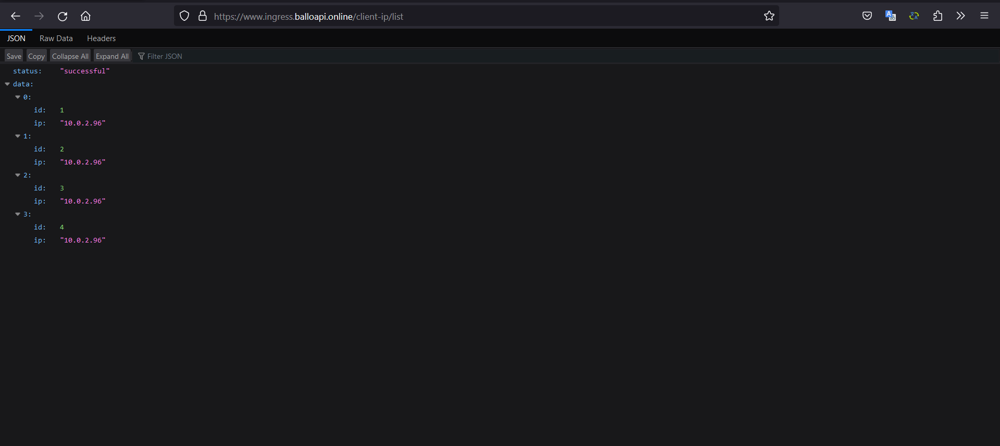
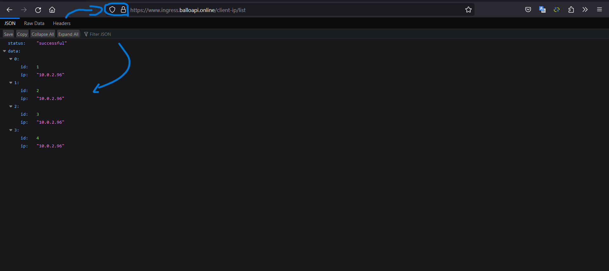

# 🚀 DevOps Infrastructure & Deployment Automation

Welcome to my DevOps project repository! this project automates AWS service and K8S resources provisioning via Terraform, Jenkins orchestrates three pipelines, the first is to automate the Provisioning of the infrastructure, and the second is to dockerize the Node.js app and push it to private repo ECR and then trigger the third pipeline (CD pipeline), third pipeline to update the image name in Helm chart values.yaml. The Node.js app effortlessly communicates with RDS and the APP stores the IP when you hit a certain endpoint and lists all the IPs stored when you hit  another endpoint, ArgoCD adds the final touch, enabling continuous deployment with GitOps principles.

##  Project Design


## :gear: Tools & Operators :
- Docker
- Terraform
- K8S (AWS EKS)
- RDS
- route53
- Jenkins
- Argocd
- Helm chart
- cert-manager
- nginx ingress

  

#### Prerequisites
- owned domain name
- AWS CLI configured with necessary permissions.
- Terraform, kubectl, and docker CLI tools should be installed 
- Jenkins and Helm installed locally
- basic knowledge about nodejs and the tools used in this project
### explanation
#### In the following lines I want to discuss each service and operator we are creating with Terraform
- EKS            --> a platform to deploy our application on
- ECR            --> a private repo to store, push, and pull the docker images
- RDS            --> the Database which we use with nodejs APP to store and display the IPs stored in
- route53        --> Create a new CNAME record to point on the ingress URL to pass the let's encrypt challenge
- nginx ingress  --> just an ingress controller!
- cert-manager   --> k8s operators to issue trusted TLS certificate
- argoCD         --> another operator for implementing the GitOps concept
- OIDC           --> apply the IRSA concept to grant the service account the permissions that it needs only

### Steps
### 1. Provision Infrastructure using Terraform
- start building your Infrastructure using terraform --> (EKS, ECR, RDS, and route53)
- create k8s oprators with terraform --> (ingress, cert-manager and argocd)
- you can find all the terraform files under `terraform` folder
- display the required attribute using output block in terraform --> (RDS endpoint, ECR URL)
### 2. create your Application
- start creating your app, in my case, I used nodejs(Express)
- the application should expose two APIs endpoints
- The first one `<your-host>.com/client-ip`, this saves your ip in the RDS
- The second one  `<your-host>.com/client-ip/list`, this displays the list of IPs stored in the database
### 3. Dockerize the application
- create a docker file for your application
- create a docker container manually to make sure that everything works well ---> only  for testing
### 4. k8s manifest files
- create required k8s manifest files for your application
- note: don't forget to create a secret for your ECR to make your cluster authorized to pull images from the ECR registry
- note: in the cluster autoscaler manifest file, you  should modify the following things:
    - the arn URL of the role for the service account
    - modify the cluster name with your real cluster name
    - modify the cluster version with your real cluster version
### 5. Helm chart
- create your Helm chart for packaging your manifest files using the following command
    - ```bash helm create <your_helm_chart_name>```
- update the values.yaml with the appropriate values
### 6. automate infra using Jenkins
- now we have to create a parameterized pipeline for automating the infrastructure creation
- in my case, I used two options as a parameters --> (apply & destroy)
- 
- Jenkins file existed under `jenkins_files` directory
- note: don't forget to add your aws credential --> aws access and secret access key
  

### 7. Automate build, push, and trigger the CD pipeline
- now we need to create a CI pipeline
- CI pipeline will pull the repo
- dockerize the nodejs app
- push the image to the ECR
- trigger the CD pipeline and send the image version as a parameter to the CD pipeline
- Jenkins file existed under `jenkins_files` directory


### 8. CD pipeline
- now we should create the CD pipeline
- CD pipeline will clone the repo
- update the HELM chart values.yaml with the image name that we get as a parameter from the CI pipeline
- push the changes to the same repo again
- - Jenkins file existed under `jenkins_files` directory
  

### 9. argocd and continuous deployment
- in this step we need to connect or sync argocd with the repo
- note: to sync the repo with argocd, we have three ways
    - 1- using the command line via argocd CLI tool
    - ```bash
      argocd repo add REPO_NAME --type REPO_TYPE --url REPO_URL --username REPO_USERNAME --password REPO_PASSWORD
      argocd app create APP_NAME --repo REPO_URL --path PATH_TO_APP --dest-server DEST_SERVER --dest-namespace DEST_NAMESPACE
       ```
    - 2- using a declarative way
    - 3- using the UI which is the way I used in this project
- add your repo to argocd repos

- create application 




#### Now let's try the app

#### Here you can look at the lock of the certificate

